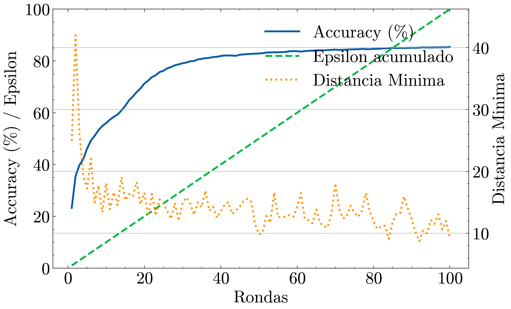
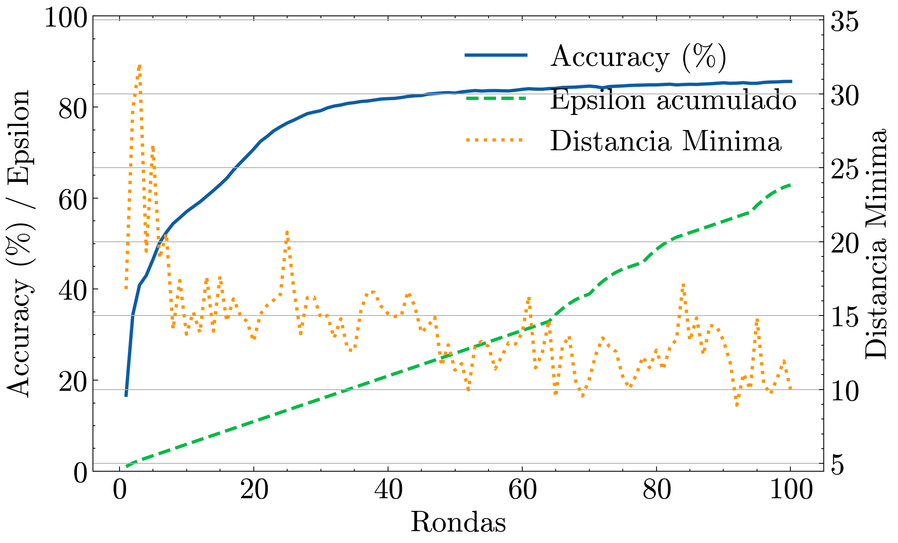
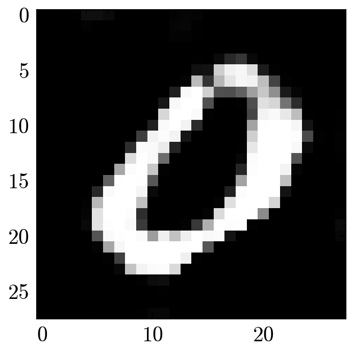
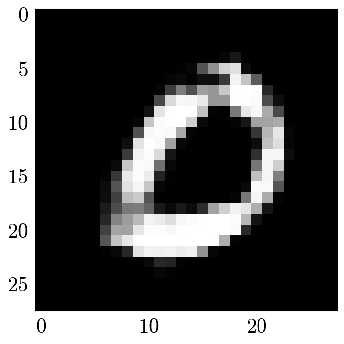

# DP Optimization within FL Scenarios 🔐

Implementation of all 8 experiments carried out in my thesis. The code explores the **optimization of Differential Privacy (DP)** within 4 differents attacks in a Federated Learning (FL) scenario.

❗ Attacks performed are the following:

* **LabelFlipping**: An attack to the federated model. The adversarial attacker flips its training labels so that the trained weights may confuse the aggregated model.

* **Gaussian**: The adversarial sends poisoned updates (following a gaussian distribution) to corrupt the federated model as well.

* **Backdoor**: A pattern is injected to every sample of the adversarial training dataset. This way, the aggregated model will learn a secondary tasks it was not supposed to learn.

* **DMUG (Deep Models Under the GAN)**: It is an attack to the privacy. An adversarial simulates to own samples of a class he does not. With the information he gets from the aggregated model, he will train a GAN so that a sample of this fake class is reconstructed.


🔎 **Linear Programming (LP)** is crucial and the core of the DP optimization. The goal is to apply differential privacy in a smart way. A LP problem is defined so that its application is optimized, always in a plausible range. To achieve so, the model loss is taken into account, relaxing privacy parameters whenever the model isn't learning, and being more privacy-restrictive when the accuracy is greater. Then, the classic SIMPLEX method is used to solve the programming problem.

📈 This way, a comparison between a **dynamic vs. static** way of applying DP is done here. Results show that it is a competetive way of optimizing privacy budget when applying DP as a defence, especially with privacy attacks. You can check the results of the experiments in the figures inside `figures_TFG.ipynb`. 

<p align="center">
  
  <br>
  <em>(Static-left, Dynamic-right) Comparison between accuracy vs. privacy budget usage trade-off in DMUG experiment.</em>
</p>

💡 Results show that the proposed method applies more restrictive privacy parameters while preserving the model performance. Check below the result of the DMUG reconstruction for 100 rounds:

<p align="center">
  
  <br>
  <em>On the left the reconstruction with no optimization made; on the right the added noise makes it more difficult to the GAN to recover the sample (while the model performance remains the same).</em>
</p>

💻Tools & Libraries used:

* [FLEXible-FL](https://github.com/FLEXible-FL) and [Flex-Clash](https://github.com/FLEXible-FL/flex-clash)  
* [SciPy Linprog](https://docs.scipy.org/doc/scipy/reference/generated/scipy.optimize.linprog.html)
* [Meta AI Opacus](https://opacus.ai/)
* [PyTorch](https://pytorch.org/)

📁 Project structure schema:
```plaintext
    .
    ├── experiments/
    │   ├── LabelFlipping (same for Gaussian and Backdoor)/
    |   |   |── MNIST/
    │   │   |  ├── DP_Static/
    |   │   │     ├── n_poisoned_experiments/
    │   │   |  └── DP_Optimized/
    |   │   │     ├── n_poisoned_experiments/
    |   |   |── FashionMNIST/
    |   |   |  ├── ...
    |   |   |── CIFAR-10/
    |   |   |  ├── ...
    │   ├── DMUG/
    │   │   ├── DP_Static/
    │   │   └── DP_Optimized/
    └── figures_TFG.ipynb
```